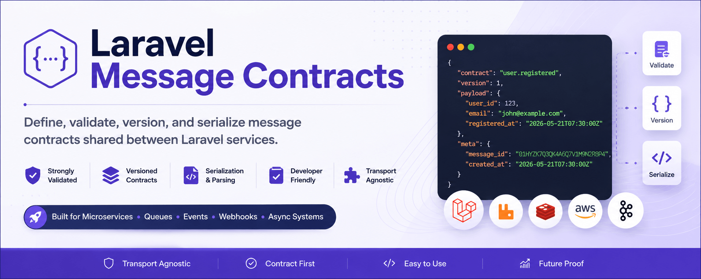

# Laravel Message Contracts

A Laravel package for defining, validating, versioning, documenting, and testing
the JSON payloads your services exchange.

<div align="center">



[](https://github.com/satheez/laravel-message-contracts/actions)
[](https://github.com/satheez/laravel-message-contracts/actions/workflows/run-tests.yml)
[](https://packagist.org/packages/satheez/laravel-message-contracts)
[](https://packagist.org/packages/satheez/laravel-message-contracts)
[](https://www.php.net)
[](https://laravel.com)
[](LICENSE.md)

</div>

Laravel Message Contracts turns queue, event, webhook, and broker payloads into
explicit PHP classes. A contract class gives each message a stable name, an
integer version, Laravel validation rules, examples, generated JSON Schema,
AsyncAPI documentation, compatibility snapshots, and test assertions.

The package is transport-agnostic. It does not replace RabbitMQ, SQS, Kafka,
Redis, Laravel queues, webhooks, an outbox, retries, or delivery guarantees. It
protects the JSON message body that moves through those systems.

Use it when multiple producers, consumers, services, or teams need a shared
payload boundary that is stricter than plain arrays but lighter than a full
schema registry.

## Highlights

- Define one source of truth for every message payload.
- Validate outgoing producer payloads before serialization.
- Validate incoming consumer payloads before business logic reads them.
- Reject unknown payload keys in strict mode.
- Keep `V1`, `V2`, and later contract versions registered side by side.
- Export JSON Schema for non-Laravel consumers.
- Generate AsyncAPI 2.6.0 documentation from registered contracts.
- Detect breaking payload changes in CI with snapshots.
- Test payloads with Pest or PHPUnit assertion helpers.
- Integrate with Spatie Laravel Data when your payload already has a data class.

## Requirements

| Requirement | Version |
| --- | --- |
| PHP | `^8.2` |
| Laravel | `^10.0`, `^11.0`, `^12.0`, or `^13.0` |

## Installation

```bash
composer require satheez/laravel-message-contracts
php artisan vendor:publish --tag=message-contracts-config
```

Optionally publish the generator stub:

```bash
php artisan vendor:publish --tag=message-contracts-stubs
```

See [Installation](docs/installation.md) for the full setup flow.

## Quick Start

Imagine you publish a `user.registered` event that an email service, analytics
pipeline, and billing service all consume. A message contract makes the payload
shape explicit, validated, and versioned so every consumer knows exactly what to
expect.

Generate a contract class:

```bash
php artisan make:message-contract UserRegistered \
  --contract-version=1 \
  --contract=user.registered
```

Define the payload rules in the generated class:

```php
use Satheez\MessageContracts\Contracts\MessageContract;

final class UserRegisteredV1Message extends MessageContract
{
    public static function contract(): string
    {
        return 'user.registered';
    }

    public static function version(): int
    {
        return 1;
    }

    public static function rules(): array
    {
        return [
            'user_id' => ['required', 'integer'],
            'email' => ['required', 'email'],
            'registered_at' => ['required', 'date'],
        ];
    }
}
```

Register it in `config/message-contracts.php`:

```php
'contracts' => [
    App\MessageContracts\UserRegisteredV1Message::class,
],
```

Create and serialize a producer message:

```php
$message = UserRegisteredV1Message::message(
    payload: [
        'user_id' => 123,
        'email' => 'john@example.com',
        'registered_at' => now()->toISOString(),
    ],
    meta: [
        'trace_id' => 'req-7f1c4c2a',
    ],
);

$json = $message->toJson();
```

Parse and validate a consumer message:

```php
use Satheez\MessageContracts\DTO\Message;

$message = Message::fromJson($json);
$message->validateOrFail();

$userId = $message->payload('user_id');
```

The default envelope contains `contract`, `version`, `payload`, and optional
`meta` keys. Metadata such as `message_id` and `created_at` can be configured.

## Important Concepts

| Concept | Summary |
| --- | --- |
| Contract name | Stable dot-notation name such as `user.registered`. Do not include the version. |
| Version | Integer starting at `1`. Add a new version for breaking payload changes. |
| Strict mode | Rejects payload keys that are not declared in `rules()`. Enabled by default. |
| Registry | Resolves incoming messages by `contract` and `version`. |
| Snapshot | Captures current schemas so CI can detect breaking changes later. |

For breaking changes, create `UserRegisteredV2Message` and keep V1 registered
until consumers migrate.

## Command Overview

| Command | Purpose |
| --- | --- |
| `make:message-contract` | Scaffold a versioned contract class. |
| `message-contracts:list` | Show registered contracts. |
| `message-contracts:validate` | Validate a raw payload or full envelope. |
| `message-contracts:validate-examples` | Validate every contract `example()`. |
| `message-contracts:export-json-schema` | Export payload or envelope JSON Schemas. |
| `message-contracts:export-asyncapi` | Export AsyncAPI documentation. |
| `message-contracts:snapshot` | Save the current contract schema snapshot. |
| `message-contracts:check-breaking-changes` | Compare current contracts to a previous snapshot. |

See [Checks](docs/checks.md), [Output formats](docs/output.md), and
[CI](docs/ci.md) for command options and CI examples.

## Documentation

| Guide | Covers |
| --- | --- |
| [Installation](docs/installation.md) | Composer install, publishing config and stubs, first contract setup |
| [Usage guide](docs/usage.md) | Defining, registering, producing, consuming, and validating messages |
| [Configuration](docs/configuration.md) | `config/message-contracts.php` options, strict mode, metadata, schema export |
| [Architecture](docs/architecture.md) | Core classes, producer flow, consumer flow, and generated docs |
| [Output formats](docs/output.md) | Message envelopes, list JSON, JSON Schema, AsyncAPI, and snapshots |
| [Checks](docs/checks.md) | Artisan validation, schema, example, and compatibility checks |
| [CI](docs/ci.md) | GitHub Actions patterns for package and application contract checks |
| [Comparison](docs/comparison.md) | How this package compares with plain arrays, Form Requests, JSON Schema, AsyncAPI, and schema registries |
| [Examples and recipes](docs/examples.md) | Versioning, testing helpers, example validation, Laravel Jobs, and producer-side patterns |
| [FAQ](docs/faq.md) | Common usage, versioning, strict mode, envelope, schema, and Spatie Data questions |

## Contributing

See [CONTRIBUTING.md](CONTRIBUTING.md) for local setup, coding standards, and
pull request guidelines.

## Changelog

All notable changes are documented in [CHANGELOG.md](CHANGELOG.md).

## License

Laravel Message Contracts is open-sourced software licensed under the
[MIT license](LICENSE.md).
