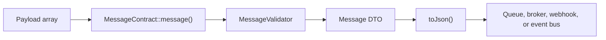
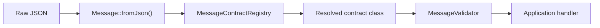

# Architecture

Laravel Message Contracts is built around a small set of transport-agnostic
classes. The package does not publish, consume, retry, or store messages. It
defines the payload contract and validates message envelopes before they cross
service boundaries.

## Core Components

| Component | Responsibility |
| --- | --- |
| `MessageContract` | Base class for a named, versioned payload contract. |
| `Message` | Immutable DTO for the serialized message envelope. |
| `MessageContractRegistry` | Resolves a contract class from `contract` and `version`. |
| `MessageValidator` | Runs Laravel validation rules and strict field checks. |
| `MessageValidationException` | Thrown when payload validation fails. Contains error details. |
| `MessageParsingException` | Thrown when raw JSON cannot be parsed into a valid envelope. |
| `InvalidMessageException` | Thrown when envelope keys (`contract`, `version`, `payload`) are missing. |
| `JsonSchemaGenerator` | Converts contract rules into JSON Schema documents. |
| `AsyncApiGenerator` | Builds an AsyncAPI 2.6.0 document from registered contracts. |
| `SnapshotManager` | Captures contract schemas for compatibility checks. |
| `SchemaComparator` | Compares old and current snapshots for breaking changes. |

> **Note:** This document contains Mermaid diagrams. If they do not render in your markdown viewer, you can view this file on GitHub.

## Producer Flow

The producer should create messages through the contract class. This keeps
payload validation next to serialization.



`MessageContract::message()` validates outgoing payloads when
`validate_outgoing` is enabled. It then builds a `Message` with the contract
name, version, payload, and configured metadata.

## Consumer Flow

The consumer should parse the envelope first, then validate against the
registered contract before business logic reads the payload.



`Message::fromJson()` and `Message::fromArray()` only parse the envelope. They
do not validate payload fields. Call `validate()` or `validateOrFail()` before
processing.

> **Note:** Use `fromArray()` when the transport layer already provides a
> decoded array (e.g., SQS with automatic JSON decoding).

## Contract Identity

A contract is identified by two values:

| Value | Example | Notes |
| --- | --- | --- |
| `contract()` | `user.registered` | Stable logical name. Do not include the version. |
| `version()` | `1` | Increment for breaking payload changes. |

Keep old versions registered while consumers migrate. Consumers can branch on
`$message->version()` when they support more than one version during a rollout.

## Envelope Shape

The default envelope contains:

```json
{
  "contract": "user.registered",
  "version": 1,
  "payload": {
    "user_id": 123,
    "email": "john@example.com",
    "registered_at": "2026-05-22T04:45:00Z"
  },
  "meta": {
    "message_id": "01JWGJ8FGM7X8Y5H0R2M6W9S4D",
    "created_at": "2026-05-22T04:45:00.000000Z"
  }
}
```

The top-level envelope keys can be changed in `message_keys` for legacy
integrations, but the package internals still treat the fields as contract,
version, payload, and meta.

## Strict Validation

Strict mode rejects payload keys that are not declared in `rules()`. This is
important for message boundaries because unexpected fields can leak internal
state or create accidental consumer dependencies.

```php
public static function rules(): array
{
    return [
        'user_id' => ['required', 'integer'],
        'email' => ['required', 'email'],
        'registered_at' => ['required', 'date'],
    ];
}
```

With strict mode enabled, a payload containing `debug_token` fails validation
because that key is not declared in the rules.

## Generated Documentation

JSON Schema and AsyncAPI output are derived from registered contract classes.
This keeps runtime validation and external documentation tied to the same
source.

```bash
php artisan message-contracts:export-json-schema --output=docs/schemas --pretty
php artisan message-contracts:export-asyncapi --format=yaml --output=docs/asyncapi.yaml
```

Use `schema()` on a contract when Laravel rules cannot express the exact JSON
Schema you need.


---

**Previous:** [Configuration](configuration.md) | **Next:** [Output formats](output.md)
